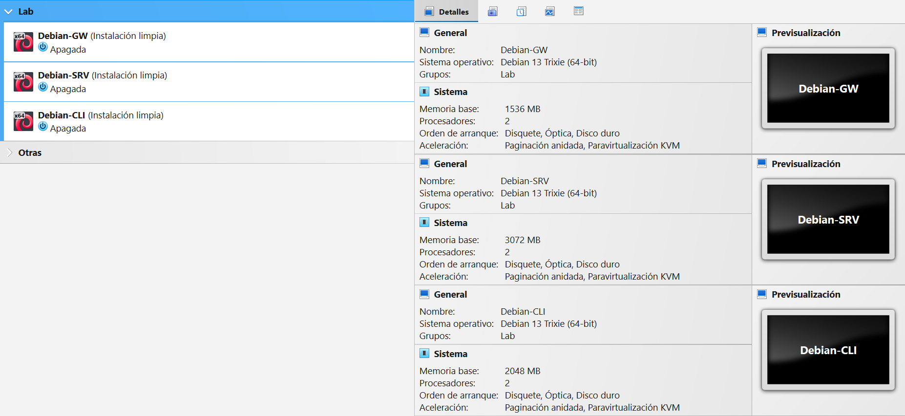
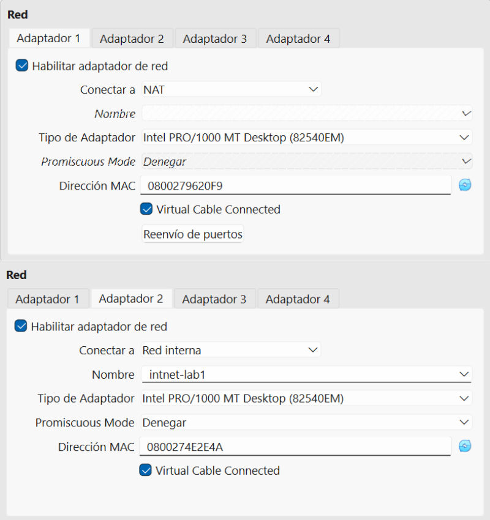
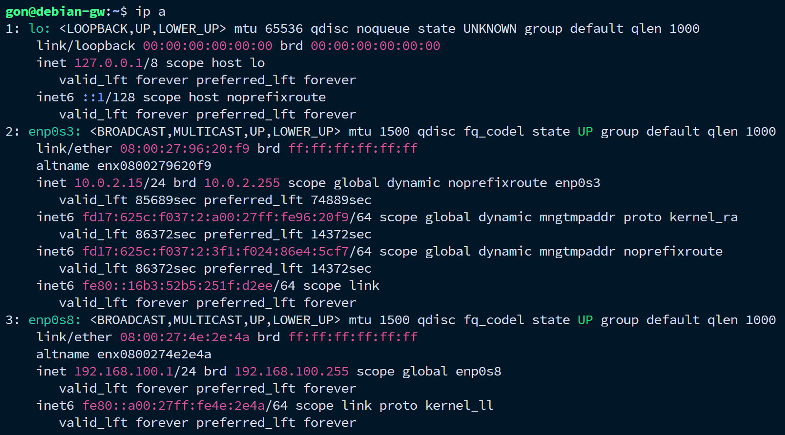
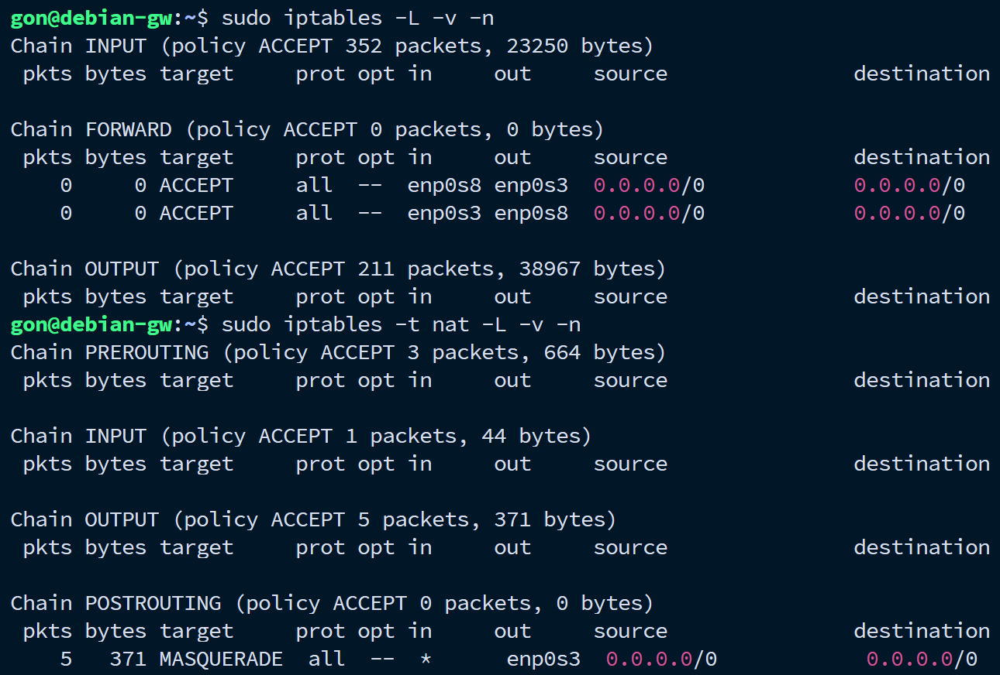
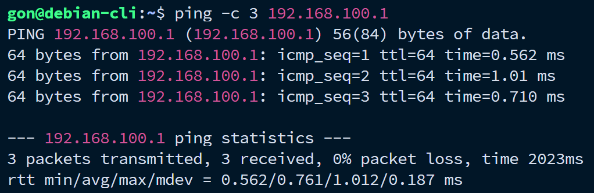
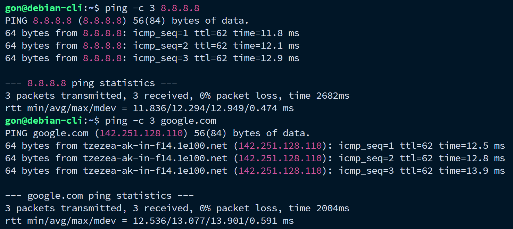

# 00 — Preparación del entorno

## Qué se hizo

- Instalación de VirtualBox y Termius.
- Creación de 3 VMs Debian: Gateway, Servidor y Cliente, con red interna aislada (`intnet-lab1`) y salida a internet mediante NAT solo en el Gateway.
- Instalación de Debian (mínima, sin entorno gráfico) en las 3 VMs.
- Actualización del sistema (`apt update && apt upgrade`) en las 3 VMs.
- Snapshot de instalación limpia en cada una.
- Configuración de acceso remoto vía SSH: port forwarding en VirtualBox (host → Debian-GW) y conexión mediante Termius. Debian-GW es la única VM expuesta al host; el acceso a Debian-SRV y Debian-CLI se realiza por SSH desde dentro de Debian-GW.

## Por qué

Antes de implementar servicios, se necesita una base funcional: máquinas virtualizadas, red interna aislada, y un gateway capaz de dar salida a internet, simulando la estructura mínima de una red pequeña real.

## Cómo se configuró

- **Debian-GW:** dos interfaces (NAT + Internal Network), enrutamiento habilitado (`ip_forward`), reglas de NAT/Masquerade con `iptables`, reglas persistidas con `iptables-persistent`.
- **Debian-SRV / Debian-CLI:** únicamente en `intnet-lab1`, con IP asignada manualmente (DNS público temporal) hasta implementar DHCP.

## Verificación

**1. Entorno virtualizado**

**2. Configuración de red de Debian-GW**

- **Adaptador 1:** modo NAT (salida a internet).
- **Adaptador 2:** Internal Network `intnet-lab1` (red interna).

**3. Interfaces de red de Debian-GW**

Ambas interfaces activas: una hacia internet (NAT) y otra hacia la red interna con IP `192.168.100.1`.

**4. Reglas de iptables en Debian-GW**

- **Tabla `filter`** (`iptables -L -v -n`): reglas `FORWARD` que permiten el tráfico de la red interna hacia internet y las respuestas de vuelta (conexiones establecidas).

- **Tabla `nat`** (`iptables -t nat -L -v -n`): regla `MASQUERADE` en `POSTROUTING`, que traduce las direcciones de la red interna a la del gateway para salir a internet.

**5. Conectividad con el gateway**

**6. Salida a internet a través del gateway**

## Resultado

Infraestructura base operativa: 3 VMs con roles definidos, red interna aislada, y salida a internet controlada por el Gateway. Lista para implementar los servicios de los siguientes módulos.