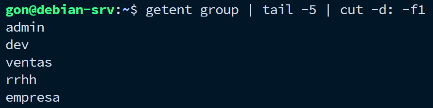
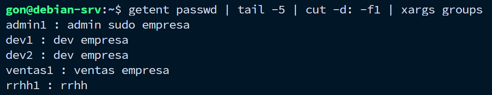
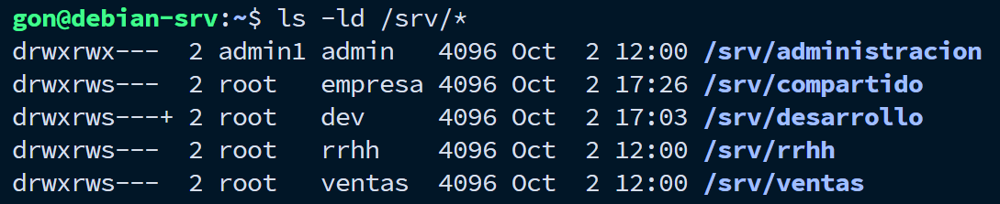
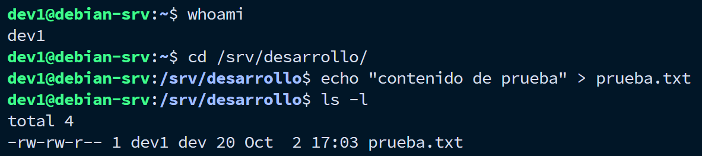
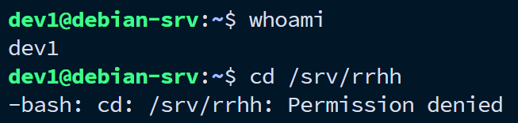
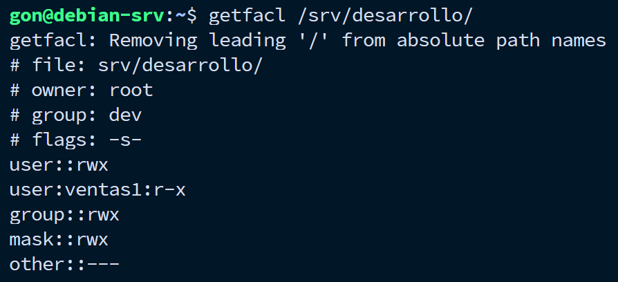
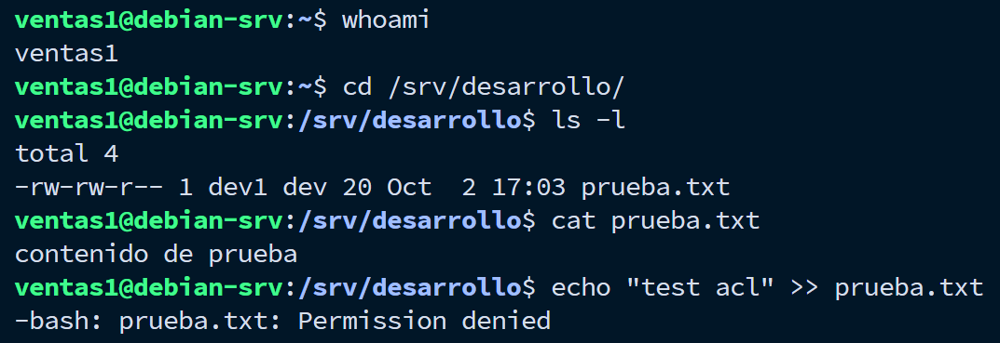
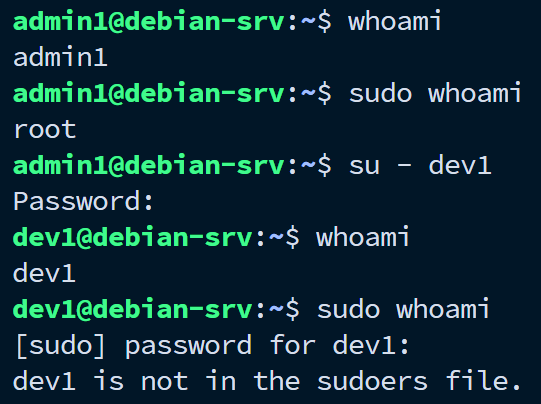
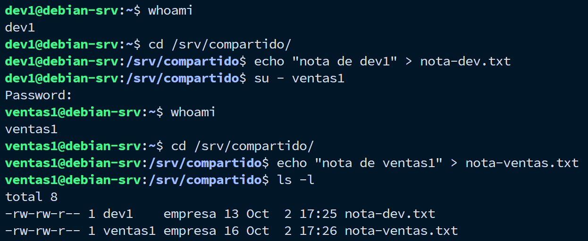
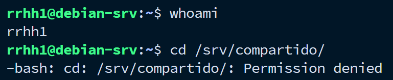

# 01 — Usuarios y permisos

## Qué se hizo

- Creación de 5 grupos (`admin`, `dev`, `ventas`, `rrhh`, `empresa`) simulando departamentos de una organización.
- Creación de 5 usuarios, cada uno con su grupo primario correspondiente. Todos pertenecen además al grupo secundario `empresa`, excepto `rrhh1`, que queda fuera para restringir su acceso al recurso compartido.
- Asignación de `admin1` al grupo `sudo`.
- Creación de una estructura de carpetas en `/srv/` con una carpeta privada por departamento y una carpeta compartida general.
- Configuración de permisos (`chown`, `chmod`) y del bit `setgid` en las carpetas de grupo.
- Configuración de una regla ACL para un caso de acceso cruzado entre departamentos.

## Por qué

Simular cómo una organización chica administra el acceso a sus recursos: cada área con su espacio privado, un área más restringida (RRHH), un recurso compartido entre todos, y caso puntual que no se resuelve solo con grupos, sino con permisos específicos (ACL).

## Escenario

| Usuario | Grupo primario | Grupos secundarios | Sudo |
|---|---|---|---|
| `admin1` | `admin` | `empresa` | Sí |
| `dev1` | `dev` | `empresa` | No |
| `dev2` | `dev` | `empresa` | No |
| `ventas1` | `ventas` | `empresa` | No |
| `rrhh1` | `rrhh` | - | No |

```text
/srv/
├── administracion/   (admin1 · admin · 770)
├── desarrollo/        (root · dev · 2770, setgid)
├── ventas/            (root · ventas · 2770, setgid)
├── rrhh/              (root · rrhh · 2770, setgid)
└── compartido/        (root · empresa · 2770, setgid)
```

## Cómo se configuró

- Grupos y usuarios creados con `groupadd` y `useradd -G`.
- Carpetas creadas en `/srv/`, con dueño y grupo asignados vía `chown`.
- Permisos base con `chmod`, incluyendo `setgid` (`chmod g+s`) para que los archivos nuevos hereden el grupo del directorio.
- `admin1` agregado al grupo `sudo` con `usermod -aG sudo`.
- Caso de acceso cruzado resuelto con ACL: `ventas1` necesita leer `/srv/desarrollo` sin pertenecer al grupo `dev` → `setfacl -m u:ventas1:rx /srv/desarrollo`.

## Verificación

**1. Grupos creados**



**2. Usuarios y sus grupos**



**3. Estructura de carpetas y permisos**



**4. Acceso permitido (grupo propio)**

`dev1` accede a `/srv/desarrollo` y puede escribir en su carpeta de departamento.



**5. Acceso denegado (otro grupo)**

`dev1` intenta acceder a `/srv/rrhh`, carpeta de otro departamento al que no pertenece.



**6. Regla ACL aplicada**

`ventas1` no pertenece al grupo `dev`, pero necesita leer `/srv/desarrollo`. Se le otorga acceso puntual mediante ACL, verificado con `getfacl`.



**7. Acceso vía ACL**

`ventas1` puede leer el contenido de `/srv/desarrollo`, pero no escribir, de acuerdo a los permisos otorgados por la ACL (`rx`).



**8. Sudo: permitido y denegado**

`admin1` puede ejecutar comandos con `sudo`; el resto de los usuarios no tiene ese privilegio.



**9. Carpeta compartida**

`dev1` y `ventas1`, de distinto grupo primario, acceden y escriben en `/srv/compartido` gracias al grupo secundario `empresa`. El bit `setgid` asegura que ambos archivos queden con grupo `empresa`, sin importar quién los creó.



**10. RRHH sin acceso al compartido**

A diferencia del resto de los departamentos, `rrhh1` no pertenece al grupo `empresa`, por lo que no tiene acceso a `/srv/compartido`.



## Resultado

Estructura de usuarios y permisos funcional, con control de acceso por departamento, un área sin acceso al recurso compartido por el tipo de información que maneja (RRHH), y un caso real de acceso puntual resuelto mediante ACL en lugar de modificar la estructura de grupos.